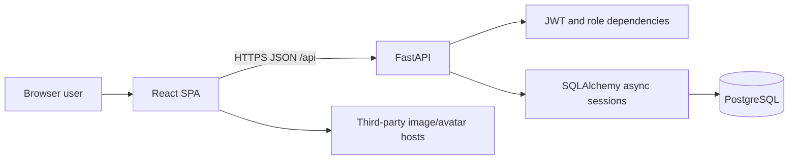
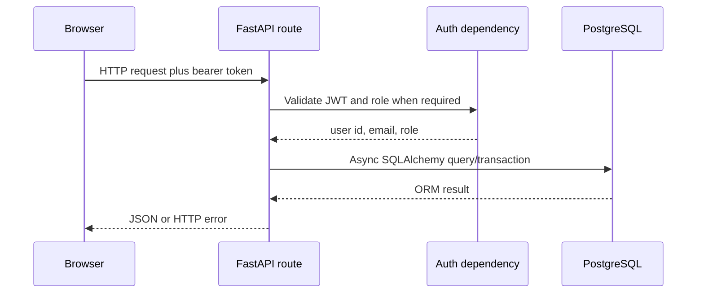
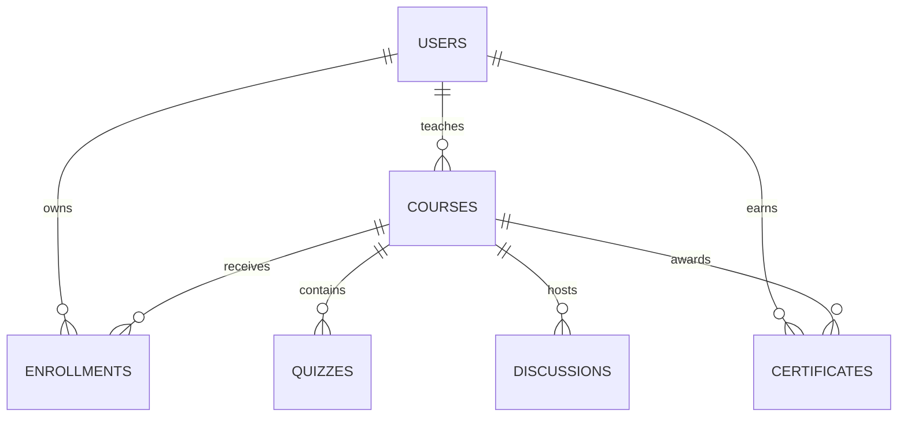
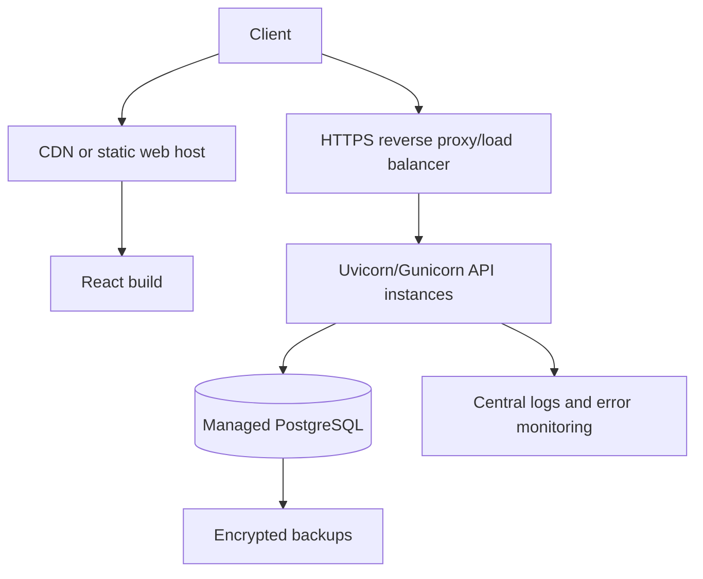

# Arsitektur Nama Organisasi Learning Management System

Dokumen ini menjelaskan arsitektur yang benar-benar diimplementasikan pada audit 2026-07-03.

## 1. Gambaran sistem

Frontend dan backend merupakan aplikasi terpisah. Frontend dibangun sebagai SPA dan memanggil REST API. Backend memvalidasi data, autentikasi, role, ownership, dan aturan bisnis sebelum membaca/menulis PostgreSQL.

## 2. Backend

### Composition root

`backend/server.py`:

- memuat `backend/.env`;
- membuat aplikasi FastAPI;
- memasang semua router di bawah `/api`;
- mengatur CORS;
- menjalankan pembuatan tabel dan seed pada startup.

### Layer

| Layer | File | Tanggung jawab |
|---|---|---|
| HTTP composition | `server.py` | App lifecycle, router, middleware |
| API/domain handlers | `routes/*.py` | Validation orchestration, authorization, business rules |
| Auth | `auth.py` | Hash password, create/decode JWT, role dependencies |
| API schema | `models.py` | Pydantic request/response types and enums |
| Persistence | `database.py` | Engine, sessions, ORM tables, serialization |
| Bootstrap data | `seed_data.py` | Idempotent demo dataset |

Route handlers currently open `AsyncSessionLocal` directly. There is no separate service/repository layer; transaction and business logic therefore live in route modules.

### Request flow

## 3. Frontend

### Structure

| Area | Responsibility |
|---|---|
| `App.js` | Browser routes, layout, authentication guard |
| `pages/` | Route-level feature UI |
| `components/` | Navigation, course cards, language switcher |
| `components/ui/` | Shared Radix/Tailwind controls |
| `context/AuthContext.js` | Current user and authentication actions |
| `services/api.js` | Axios instance and typed-by-convention API functions |
| `i18n/` | Language detection and translation catalogs |

### State and networking

The application uses React context for authentication and local component state for most UI. Axios has a request interceptor that reads `token` from `localStorage` and attaches it to every API call. A failed session restore clears cached authentication.

The API remains the authorization boundary. Frontend guards improve navigation but must never replace backend role/ownership checks.

## 4. Data architecture

### Tables

- `users`: identity, password hash, profile, role.
- `courses`: catalog data, instructor FK, JSON curriculum/skills/subtitles.
- `enrollments`: membership, completed lesson IDs, calculated progress.
- `quizzes`: lesson association and JSON question collection.
- `discussions`: course posts and denormalized author display data.
- `certificates`: unique user-course completion record.

String UUIDs are generated in application code. Unique indexes prevent duplicate enrollments and certificates.

## 5. Core flows

### Login

1. Frontend submits email/password.
2. Backend loads user by email and verifies bcrypt hash.
3. Backend issues JWT with `sub`, `email`, and `role`.
4. Frontend saves token, reloads `/auth/me` on future startup, and attaches bearer token.

### Enrollment and progress

1. User enrolls with a course ID.
2. Unique database constraint prevents duplicates.
3. Progress updates toggle a lesson ID in JSON `completed_lessons`.
4. Handler calculates percentage against lessons in the course curriculum and updates completion state.

### Instructor course ownership

Instructor-only dependency validates role. Update/delete handlers must additionally match course `instructor_id` to the token subject.

### Admin operations

Admin-only dependency validates role. User mutations include protections against self-deletion and self-demotion.

## 6. Security boundaries

| Boundary | Current control | Gap to address |
|---|---|---|
| Password storage | Passlib bcrypt | Add password policy and auth rate limits |
| API identity | Signed expiring JWT | Add revocation/rotation strategy if required |
| Role access | FastAPI dependencies | Refresh token after role changes |
| Object access | Handler ownership checks | Maintain tests for every owned resource |
| Browser/API | CORS middleware | Restrict wildcard origins in production |
| Input | Pydantic and query constraints | Add stricter business validation where needed |
| Secrets | Environment variables | Remove reliance on code fallback secret |

Public registration currently accepts a role. This is a trust-boundary concern: production should force `student` unless an authorized administrator provisions elevated users.

## 7. Deployment architecture

Recommended production topology:

Run database migrations as a dedicated release step before switching traffic. Do not rely on `create_all()` for production schema evolution.

## 8. Architectural risks and evolution

- Add Alembic for repeatable schema upgrades and rollback.
- Move complex route logic into service functions as the domain grows.
- Add a repository/testing seam or dependency-injected sessions for isolated tests.
- Consider normalized curriculum/lesson tables if querying individual lessons becomes important.
- Add token revocation/refresh only if product requirements justify the complexity.
- Keep OpenAPI, frontend API client, and [contracts.md](contracts.md) synchronized.
